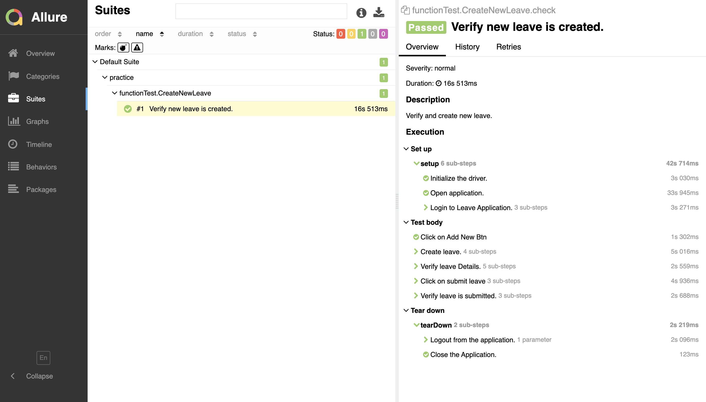

# Leave application using Selenium and TestNG.
* The framework is for created for performing different operation on Leave applications.

## Project Description:
* Can interact with web applications
* Can compare objects retrieved from UI.

## Getting Started

#### Tech Stack
* **JAVA 8** as ther programming language for writing test code.
* **Selenium** and **TestNG** as the frameworks.
* **Allure** for test reporting.

#### Setup:
* Install [Maven](https://maven.apache.org/)
* Install [TestNG](http://testng.org/)
* Install [Allure](https://github.com/allure-framework/allure-docs/blob/master/docs/getstarted.adoc)

#### IDE 
* Intellij 

#### Deployment Instruction
* Clone the repositoty or download the zip and Unzip the project into local Directory.
* Import the Project folder into the Intellij .

#### Running Tests
* You can run the test direclty by right click on Test from src/test/java/functionTest, select `Run As` option and click on `TestNG Test`.
* You can run test using `testNG.xml` by Right click on testNG.xml , select `Run testNG.xml`.

#### Report Generation
* Run `allure serve allure-result` in terminal.

